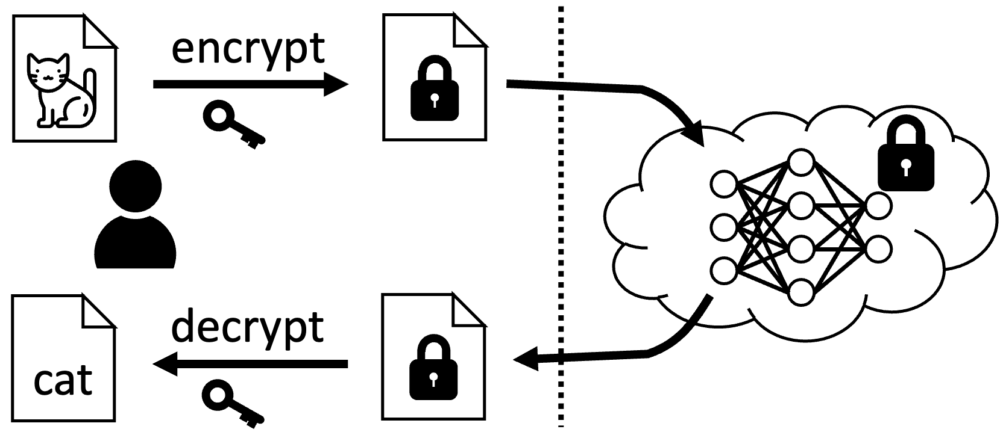
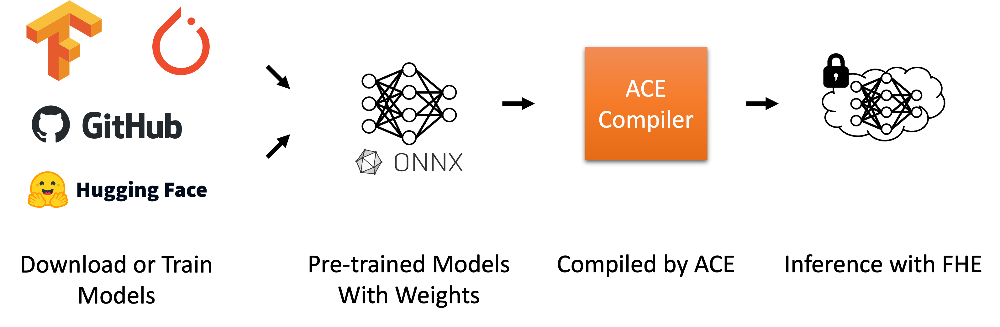
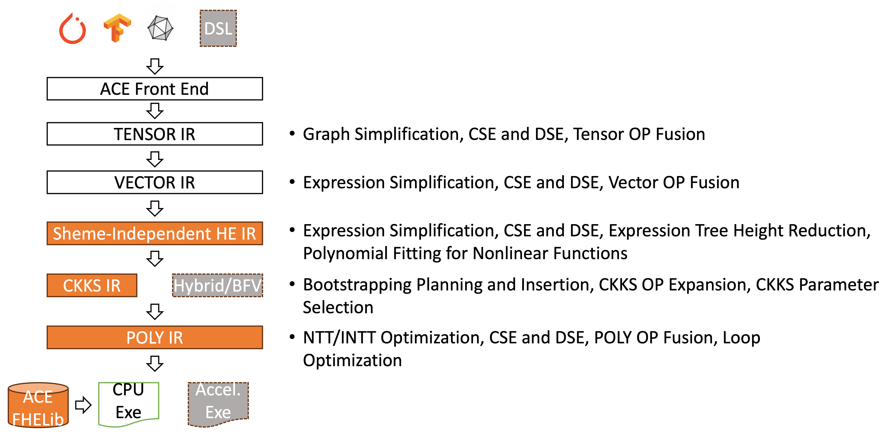

# Introduction

<b>ANT-ACE</b> is a Fully Homomorphic Encryption (FHE) Compiler Framework designed for automating Neural Network (NN) Inference. ANT-ACE accepts a pre-trained ONNX model as input and directly generates C/C++ programs to perform NN inference on encrypted data.

FHE represents a revolutionary cryptographic technology that enables direct computations on encrypted data without the need for decryption. This powerful technique allows for the manipulation of sensitive data while ensuring that the computing party remains unaware of the actual information, yet still produces valuable encrypted output.

<div align="center"><i>Decrypt(Homo_Add(Encrypt(a), Encrypt(b))) == Add(a, b)</i></div>
<div align="center"><i>Decrypt(Homo_Mult(Encrypt(a), Encrypt(b))) == Mult(a, b)</i></div>

ANT-ACE is tailored for Privacy-Preserving Machine Learning (PPML) Inference Applications. In this setup, ML inference operates in the cloud, enabling clients to upload their data and receive inference results. Typically, ML inference services transfer both data and results in plaintext, risking exposure to privacy breaches. Although traditional symmetric encryption secures data during transmission, it does not prevent privacy leaks within the cloud infrastructure. There is a risk that service providers might access the data, either inadvertently or with malicious intent. However, using homomorphic encryption allows ML inference to be performed directly on encrypted user data. This method ensures that sensitive user data is shielded from unauthorized access at all stages of the cloud-based inference process.

<p align="center"></p>

ANT-ACE takes a pre-trained ML model as input and compiles it into an FHE program directly for both the server side and client side. This makes ANT-ACE easily integrable into any existing ML framework, such as ONNX, PyTorch, TensorFlow, and others. In this way, the development of FHE applications is greatly simplified. As a result, developers won't need to understand the sophisticated mathematical foundations behind FHE, grasp the intricacies of effectively using FHE libraries, or manually manage trade-offs between correctness, security, and performance involving security parameter selection and complex optimizations regarding homomorphic operations such as noise and scale management. This significantly simplifies the development process for FHE applications.

<p align="center"></p>

Currently, ANT-ACE is designed with a compiler infrastructure that supports five levels of abstraction (i.e., five IRs) to compile pre-trained ML models operating on multi-dimensional tensors into low-level polynomial operations. These five phases successively translate pre-trained models into C/C++ programs by automatically performing various analyses and optimizations to make trade-offs between correctness, security, and performance.

<p align="center"></p>


The ANT-ACE compiler framework marks an initial step in our FHE compiler technology research. We have developed fundamental capabilities for an FHE compiler focused on privacy-preserving machine learning inference, showcased through multiple abstraction levels that automate ONNX model inference using CKKS-encrypted data on CPUs. Future extensions of ANT-ACE will support various input formats and FHE schemes across different computing architectures, including GPUs, enhanced by contributions from open-source communities.
</div>
</div>

# Repository Overview
- **air-infra:** Contains the base components of the ACE compiler.
- **fhe-cmplr:** Houses FHE-related components of the ACE compiler.
- **FHE-MP-CNN:** Directory with EXPERT-implemented source code.
- **model:** Stores pre-trained ONNX models.
- **nn-addon:** Includes ONNX-related components for the ACE compiler.
- **scripts:** Scripts for building and running ACE and EXPERT tests.
- **README.md:** This README file.
- **Dockerfile:** File used to build the Docker image.
- **requirements.txt:** Specifies Python package requirements.

# Build ANT-ACE Compiler

## 1. Preparing a Docker environment to Build and Test the ANT-ACE Compiler

It's recommended to use a Docker environment to Build and Test the ANT-ACE Compiler. We provide the [*Dockerfile*](https://github.com/ant-research/ace-compiler/blob/main/Dockerfile) to build the Docker image. The docker image is based on Ubuntu 20.04. You may set up your own environment on other Linux platforms with necessary Linux and Python packages listed in [*Dockerfile*](https://github.com/ant-research/ace-compiler/blob/main/Dockerfile) and [*requirements.txt*](https://github.com/ant-research/ace-compiler/blob/main/requirements.txt). We recommended to pull the pre-built docker image (opencc/ace:latest) from Docker Hub:

```
mkdir ace-compiler && cd ace-compiler
docker pull opencc/ace:latest
docker run -it --name ace -v "$(pwd)":/app --privileged opencc/ace:latest bash
```
A local directory `ace-compiler` is created and mounted in the docker container. The container will launch and automatically enters the `/app` directory:
```
root@xxxxxx:/app#
```
Alternatively, if you encounter issues pulling the pre-built image, you can build the image from the [*Dockerfile*](https://github.com/ace-compiler/ace-compiler/blob/main/Dockerfile):
```
git clone https://github.com/ace-compiler/ace-compiler.git
cd ace-compiler
docker build -t ace:latest .
docker run -it --name ace -v "$(pwd)":/app --privileged ace:latest bash
```

## 2. Building the ACE Compiler
To build the ACE compiler, navigate to the `/app` directory within the container and run:
```
/app/scripts/build_cmplr.sh Release
```
Upon successful completion, you will see:
```
Info: build project succeeded. FHE compiler executable can be found in /app/ace_cmplr/bin/fhe_cmplr
root@xxxxxx:/app#
```
The ACE compiler will be built under `/app/release` and installed in the `/app/ace_cmplr` directory.

For debug purpose, run
```
/app/scripts/build_cmplr.sh Debug
```
The ACE compiler will be built under `/app/debug`.

## 3. Building and run ResNet20-CIFAR model
To build the ResNet20-CIFAR model, navigate to the `/app/release` directory within the container and run:
```
cd /app/release
/app/scripts/build_resnet20_cifar10.sh test
```
'test' is just a configuration name and can be replaced by any other string. Upon successful completion, you will see:
```
[INFO]: build resnet20_cifar10 succeeded.
root@xxxxxx:/app/release#
```

To run this model with first 10 images in CIFAR-10 dataset, run:
```
./dataset/resnet20_cifar10.test test_batch.bin 0 9
```
where 'test_batch.bin' is the path to CIFAR-10 data file, 0 and 9 is the index of start and end image. 

