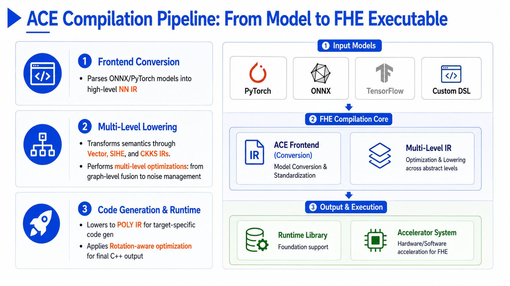

# ACE-Compiler: An FHE Domain-Specific Compiler

ACE-Compiler is the compiler component of the ANT-ACE framework. It compiles PyTorch models, Python functions, and ONNX models into optimized FHE ciphertext programs, targeting multiple libraries (CPU/GPU) and encryption schemes (CKKS, TFHE).

Plaintext and FHE computation are seamlessly integrated: write code using familiar PyTorch/ONNX/Python, and the framework automatically converts it to encrypted execution.

## Features

- **Multi-frontend input**: PyTorch (FX trace), Python AST, ONNX file, or via-ONNX conversion
- **Multi-target execution**: CPU (antlib, SEAL, OpenFHE) and GPU (phantom, acelib) targets
- **CKKS scheme support**: Configurable polynomial degree, scaling factor, and multiplication depth
- **One-step or two-step workflow**: `@fhe.compute` for compile+run; `@fhe.compile` for compile-then-run
- **Batch and dataset inference**: Single input, batch parallelism, or full dataset with accuracy metrics
- **CUDA Graph acceleration**: Replay captured GPU execution graph for reduced launch overhead
- **Built-in profiler**: Profile FHE execution with `program.profile()` using torch.profiler

## Quick Start

- One-step: compile and run
```python
import torch
from ace import fhe

@fhe.compute(frontend="torch", library="antlib", device="cpu", validate=True)
def add(x, y):
    return x + y

x = torch.ones(1, 4)
y = torch.ones(1, 4) * 2
result = add(x, y)                  # FHE inference with auto-validation
```

- Two-step: compile first, then run
```python
@fhe.compile(frontend="torch", library="antlib", device="cpu")
def add(x, y):
    return x + y

program = add.compile([x, y])       # Compile
result = program(x, y)              # Run inference
program.validate()                  # Verify correctness
```

- GPU inference with compile options
```python
@fhe.compile(frontend="torch", library="phantom", device="cuda",
             ckks={"N": 65536, "sf": 56})
def add(x, y):
    return x + y

program = add.compile([x, y])
result = program(x, y)
```

- Batch inference with accuracy metrics
```python
program = model.compile([example_input])
result = program.run_dataset(images, labels, top_k=1)
print(f"Top-1 accuracy: {result.top1_accuracy:.2%}")
```

## Compilation Pipeline



## Installation

```bash
pip install ace-fhe
```

For building from source and development setup, see [Developer Guide](docs/dev/develop.md).

## API Reference

| API | Description | Details |
|-----|-------------|---------|
| `@fhe.compile` | Compile function/model to FHE program | [Decorators API](docs/api/decorators.md) |
| `@fhe.compute` | Compile and run in one step | [Decorators API](docs/api/decorators.md) |
| `@fhe.export` | Export IR to file (AIR/ONNX) | [Decorators API](docs/api/decorators.md) |
| `program(x, y)` | High-level FHE inference | [Runtime API](docs/api/runtime.md) |
| `program.run_dataset()` | Batch inference with accuracy | [Runtime API](docs/api/runtime.md) |
| `KernelExecutor` | Low-level kernel management, CUDA Graph | [Runtime API](docs/api/runtime.md) |
| `ckks`, `vec`, `p2c`, ... | Compile options | [Compile Options](docs/api/compile_options.md) |

## Libraries

| Library | Device | Binary | Status |
|---------|--------|---------|--------|
| `antlib` | CPU | `libFHErt_ant` | Available |
| `phantom` | CUDA | `libFHErt_phantom` | Available |
| `acelib` | CUDA | `libFHErt_ace` | Available |
| `seal` | CPU | Microsoft SEAL | Planned |
| `openfhe` | CPU | OpenFHE | Planned |

## Project Structure

```
ace-compiler/
├── fhe_dsl/                # FHE DSL source (Python + C++)
│   ├── python/             # Python package (installed as `ace-fhe`)
│   └── csrc/               # C++ extension (frontend, runtime)
├── fhe_lib/                # FHE runtime libraries
│   ├── ant/                # antlib (CPU)
│   ├── ace/                # acelib (CUDA)
│   └── common/             # Shared runtime code
├── compiler/               # FHE compiler (fhe_cmplr)
├── examples/               # Example scripts
├── tests/                  # Test suites
└── scripts/                # Build and development scripts
```

## Publications

- **CGO '26** — **FHEFusion**: Enabling Operator Fusion in FHE Compilers for Depth-Efficient DNN Inference
- **OOPSLA '25** — **MetaKernel**: Enabling Efficient Encrypted Neural Network Inference through Unified MVM and Convolution
- **ASPLOS '25** — **ReSBM**: Region-based Scale and Minimal-Level Bootstrapping Management for FHE via Min-Cut
- **CGO '25** — **ANT-ACE**: An FHE Compiler Framework for Automating Neural Network Inference


## License

Apache License 2.0 with LLVM-exception