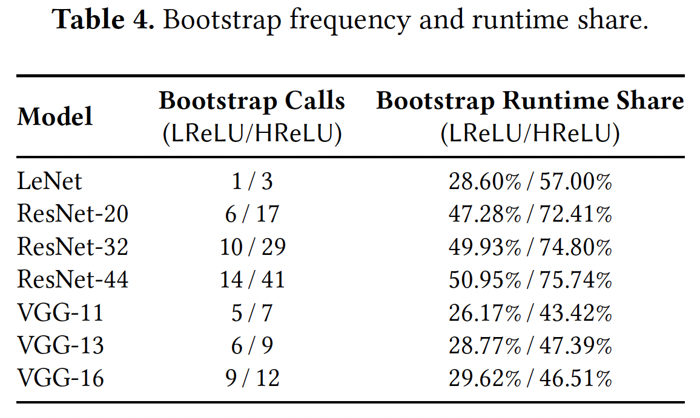
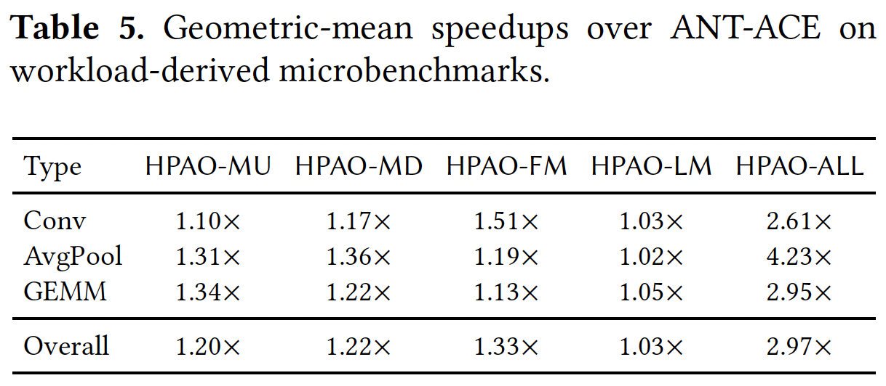
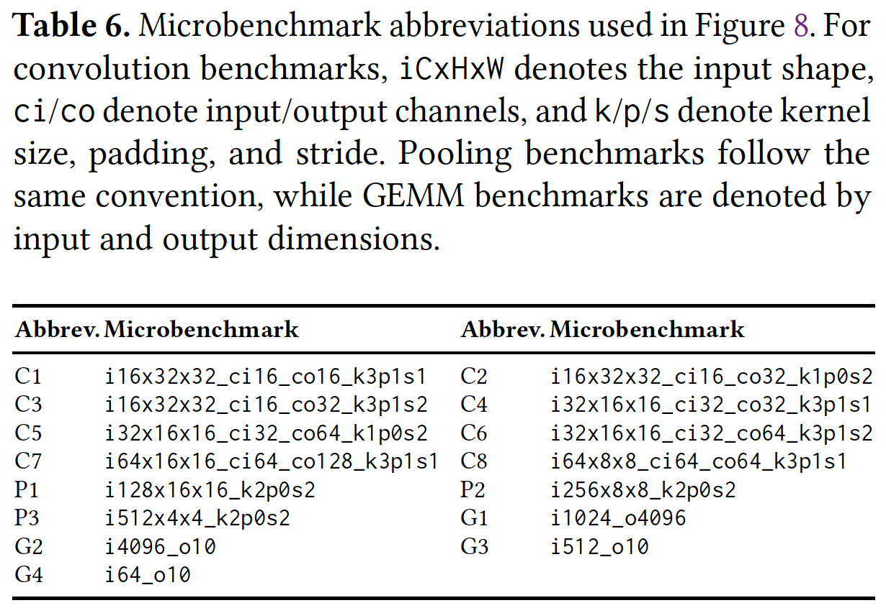
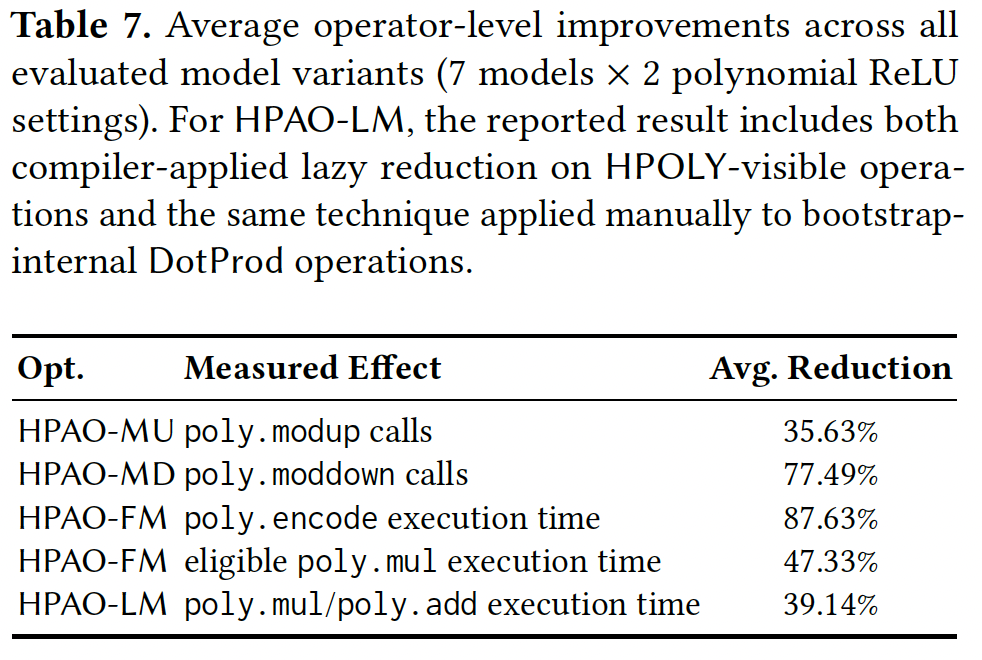
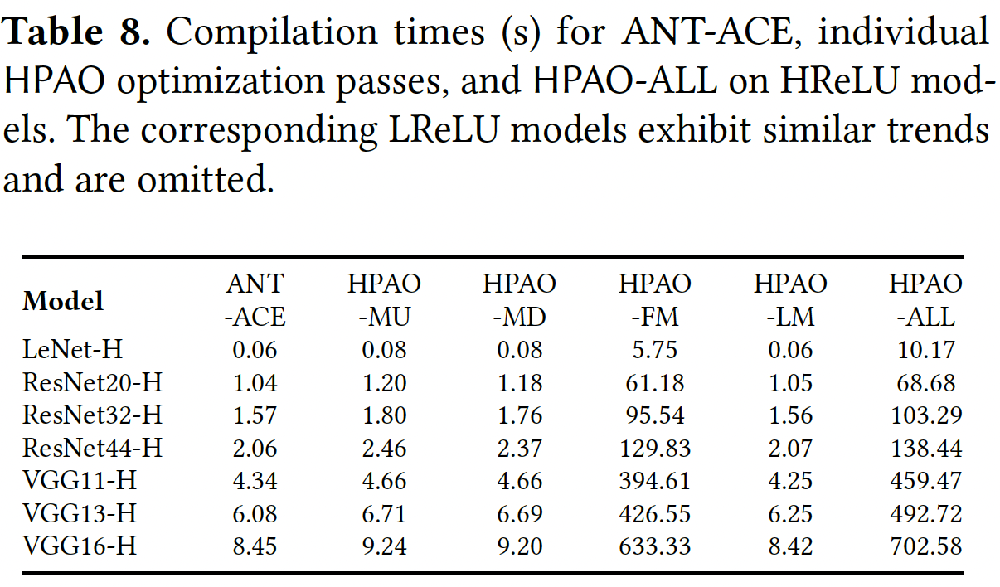
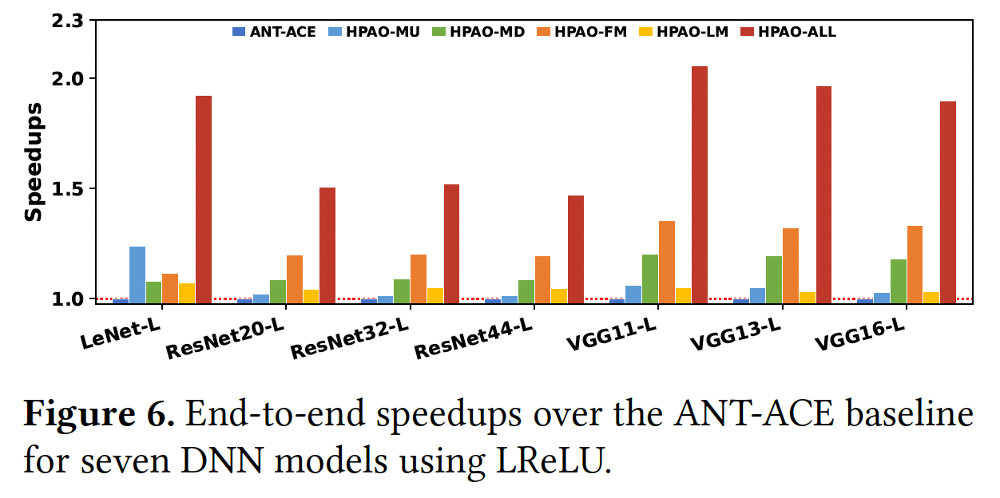
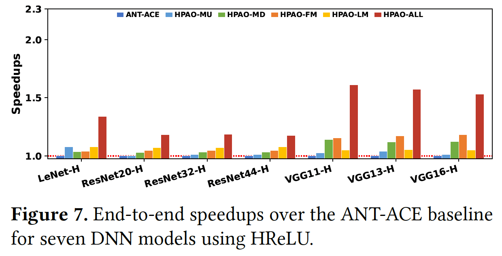
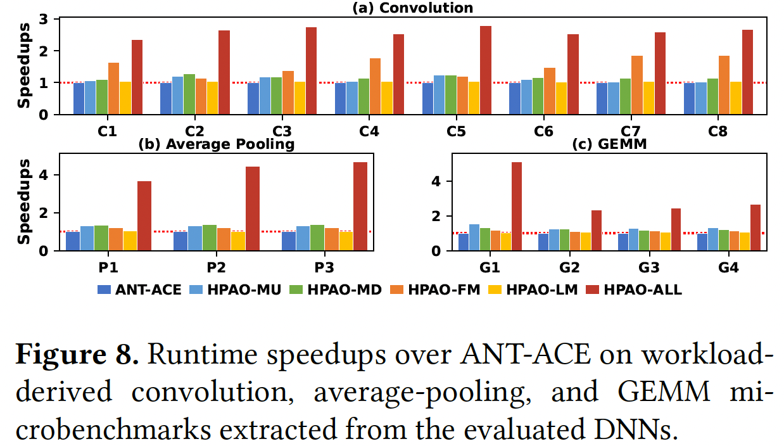

README
================

We provide instructions to enable the evaluation of the artifact associated with our CGO'27 Paper, titled "HPAO: Polynomial-Level Optimization for RNS–CKKS Programs". This paper presents HPAO, a compiler framework for polynomial-level optimization of RNS-CKKS programs(https://github.com/ant-research/ace-compiler/tree/hpao).

Existing FHE compilers treat operations such as KeySwitch, Rotate, and Multiply as atomic nodes, so they cannot analyze or optimize the internal structure of KeySwitch. HPAO introduces HPOLY, a compact polynomial-level IR that treats polynomials as first-class objects and explicitly models KeySwitch sub-operations such as ModUp, DotProd, and ModDown, thereby exposing cross-primitive optimization opportunities. Guided by HSSA-based dataflow analysis, algebraic transformation rules (Commutative, Distributive, Equivalent), and a profitability-aware cost model, HPAO systematically automates four optimizations previously implemented only manually or inside specialized library routines: ModUp hoisting (HPAO-MU), ModDown sinking (HPAO-MD), fast multiply with static encoding (HPAO-FM), and lazy modular reduction via bit-width analysis (HPAO-LM). HPAO is implemented in the open-source ANT-ACE compiler [Li et al. CGO'25](https://dl.acm.org/doi/10.1145/3696443.3708924) as a ~10,000-line C/C++ extension.

In our evaluation, we compare HPAO with the ANT-ACE baseline, holding the application algorithms, parameter management, code-generation pipeline, runtime library, and hardware constant, to isolate the incremental benefit of HPOLY and the four HPAO passes. We evaluate seven DNN models widely used in FHE—LeNet, ResNet-20/32/44, and VGG-11/13/16—on CIFAR-10 under RNS-CKKS. For each model we evaluate two polynomial ReLU settings: a high-degree minimax approximation (HReLU), which requires frequent bootstrapping, and a low-degree approximation f(x)=x^2 (LReLU), which requires much less bootstrapping—14 model variants in total. We compare six compiler configurations: the ANT-ACE baseline, each optimization in isolation (HPAO-MU, HPAO-MD, HPAO-FM, HPAO-LM), and all four combined (HPAO-ALL). In addition to end-to-end runtime, we evaluate workload-derived convolution, average-pooling, and GEMM microbenchmarks that do not involve bootstrap, and we collect operator counts, operator-level timings, and compilation time. Across these workloads, HPAO achieves end-to-end speedups of up to 2.06×, with geometric-mean speedups of 1.75× on LReLU and 1.36× on HReLU over ANT-ACE.

The objective of this artifact evaluation is to reproduce our results, presented in Tables 4-8 and Figures 6-8:
- **Table 4**: Bootstrap frequency and runtime share.
- **Table 5**: Geometric-mean speedups over ANT-ACE on workload-derived microbenchmarks.
- **Table 6**: Microbenchmark abbreviations used in Figure 8.
- **Table 7**: Average operator-level improvements across all evaluated model variants (7 models × 2 polynomial ReLU settings).
- **Table 8**: Compilation times (s) for ANT-ACE, individual HPAO optimization passes, and HPAO-ALL on HReLU models.
- **Figure 6**: End-to-end speedups over the ANT-ACE baseline for seven DNN models using LReLU.
- **Figure 7**: End-to-end speedups over the ANT-ACE baseline for seven DNN models using HReLU.
- **Figure 8**: Runtime speedups over ANT-ACE on workload-derived convolution, average-pooling, and GEMM microbenchmarks extracted from the evaluated DNNs.

*Let us begin by noting that performing artifact evaluation for FHE compilation, especially for encrypted inference, is challenging due to the substantial computing resources and significant running times required.*

It is important to highlight that FHE remains significantly slower—by up to **10,000×**—compared to unencrypted computation, even for relatively small machine learning models. Generating the results shown in **Tables 4–8** and **Figures 6–8** takes approximately **60 hours**.

To support artifact evaluation, we provide detailed instructions, including environment setup and execution guidelines, to ensure that our research findings can be independently verified.

**Hardware Setup:**  
- Intel Xeon Platinum 8369B CPU @ 2.70 GHz  
- 1 TB memory
- 300 GB free disk space

**Software Requirements:**  
- x86_64 Linux (64-bit) with Docker enabled
- Detailed in the [*Dockerfile*](https://github.com/ant-research/ace-compiler/blob/hpao/Dockerfile) for Docker container version 26.1.3
- Docker image based on Ubuntu 24.04

Encrypted inference is both compute-intensive and memory-intensive. A computer with at least **512GB** of memory is required to perform artifact evaluation for our work.

## Repository Overview
- **air-infra:** Contains the base components of the ACE compiler with HPAO support.
- **fhe-cmplr:** Houses FHE-related components of the ACE compiler with HPAO support.
- **nn-addon:** Includes ONNX-related components for the ACE compiler with HPAO support.
- **model:** Stores ONNX models.
- **scripts:** Scripts for building and running HPAO and tests, and for generating all figures and tables.
- **test:** Test related.
- **README.md:** This [*README*](https://github.com/ant-research/ace-compiler/blob/hpao/README.md) file.
- **Dockerfile:** Used to build the Docker image for running all tests.
- **requirements.txt:** Specifies Python package requirements.

### 1. Preparing a DOCKER environment to Build and Test the HPAO

It is recommended to pull the pre-built docker image (opencc/ace:hpao) from Docker Hub:
```
cd [YOUR_DIR_TO_DO_AE]
mkdir -p ae_result
docker pull opencc/ace:hpao
docker run -it --name hpao -v "$(pwd)"/ae_result:/app/ae_result --privileged opencc/ace:hpao bash
```
A local directory `ae_result` is created and mounted in the docker container to collect the generated figures and tables. The container will launch and automatically enters the `/app` directory:
```
root@xxxxxx:/app#
```

*Note: The Docker image is approximately 2.3 GB and may take **several minutes to over an hour** to download, depending on your network speed.*

### 2. Running All Tests

In the `/app` directory of the container, run:
```
/app/scripts/run_full.sh > hpao.log 2>&1 &
```

This command will perform the following actions:
  - Build ACE compiler with HPAO
  - Compile and run all cases
  - Generate all figures and tables in /app/ae_result inside docker or [YOUR_DIR_TO_DO_AE]/ae_result on host

Upon successful completion, you will see:
```
......
All artifacts written to /app/ae_result
All steps completed successfully
```

*Note 1: For the hardware environment outlined above, it will take **approximately 60 hours** to complete all the HPAO tests using a single thread.*

The script will generate results corresponding to the figures and tables presented in the evaluation section of our paper. The output files include: `tab4.pdf`, `tab5.pdf`, `tab6.pdf`, `tab7.pdf`, `tab8.pdf`, `fig6.pdf`, `fig7.pdf`, and `fig8.pdf`. For raw data, please refer to the corresponding `.log` files in `/app/ae_result/hpao`.

Here is what you can expect from each file:

- **tab4.pdf**:
  
- **tab5.pdf**:
  
- **tab6.pdf**:
  
- **tab7.pdf**:
  
- **tab8.pdf**:
  
- **fig6.pdf**:
  
- **fig7.pdf**:
  
- **fig8.pdf**:
  

*Note: The appearance of the generated PDF files may vary slightly depending on the hardware environment used.*
