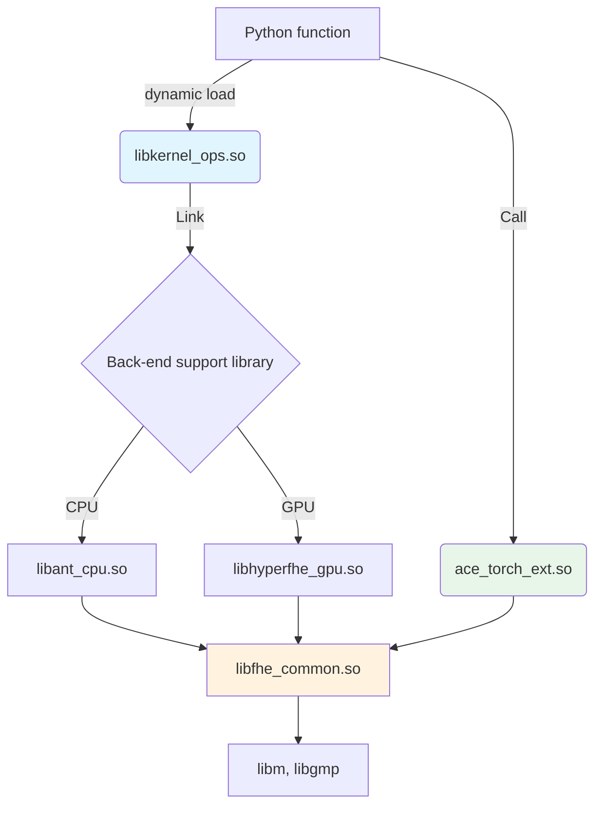

# Backend Design

## Overview

The backend module handles the final compilation step, converting IR to executable shared libraries. It supports multiple backends (CPU/GPU) and encryption schemes.

## Backend Implementations

| Backend | Device | Library | Description |
|---------|--------|---------|-------------|
| antlib | cpu | libFHErt_ant | Ant Group FHE runtime library |
| seal | cpu | libFHErt_ant + SEAL | Microsoft SEAL integration |
| openfhe | cpu | OpenFHE | OpenFHE library integration |
| phantom | cuda | libFHErt_phantom | GPU-accelerated FHE (CUDA) |
| hyperfhe | cuda | libFHErt_hyperfhe | High-performance GPU FHE (H100/sm_90) |

## IR Format Handling

Backends receive IR in one of three formats:

| IR Format | Class | format_type | file_format | Backend Handling |
|-----------|-------|-------------|-------------|------------------|
| Memory | `FHEProgram` | "memory" | - | Direct in-memory compilation (TODO) |
| ONNX File | `ONNXFileIR` | "file" | "onnx" | fhe_cmplr compiles ONNX directly |
| AIR File | `AIRFileIR` | "file" | "air" | fhe_cmplr compiles AIR binary |

## Backend Base Class

```python
class Backend(ABC):
    """Abstract base class for backend execution engines."""

    @classmethod
    @abstractmethod
    def backend_name(cls) -> str:
        """Return the FHE backend name, e.g., 'antlib'."""
        pass

    @classmethod
    @abstractmethod
    def device_name(cls) -> str:
        """Return the hardware device name, e.g., 'cpu'."""
        pass

    @classmethod
    @abstractmethod
    def supported_format_types(cls) -> List[str]:
        """List of IR types this backend can compile (e.g., ['memory', 'file'])."""
        pass

    @abstractmethod
    def check_available(self) -> bool:
        """Check if this backend is available on the current system."""
        pass

    @abstractmethod
    def compile_to_lib(self, ir, output_dir: str) -> str:
        """Compile IR to shared library.

        Args:
            ir: IR object (FHEProgram, ONNXFileIR, AIRFileIR) or file path
            output_dir: Output directory for generated files

        Returns:
            Path to generated .cpp file
        """
        pass

    @abstractmethod
    def build_command(
        self,
        source: str,
        output: str,
        ace_root: Optional[str] = None,
        extra_flags: Optional[List[str]] = None
    ) -> List[str]:
        """Construct build command for compiling .cpp to .so."""
        pass
```

## Backend Compilation Flow

```
┌─────────────────────────────────────────────────────────────────────────────┐
│                          Backend Compilation                                 │
│                                                                             │
│  Input: IR (FHEProgram / ONNXFileIR / AIRFileIR)                            │
│                                                                             │
│  ┌─────────────────────────────────────────────────────────────────────┐   │
│  │ format_type check                                                    │   │
│  │                                                                      │   │
│  │ if format_type == "file":                                            │   │
│  │     if file_format == "onnx":                                        │   │
│  │         → fhe_cmplr onnx_file → .cpp                                 │   │
│  │     elif file_format == "air":                                       │   │
│  │         → fhe_cmplr air_file → .cpp                                  │   │
│  │ elif format_type == "memory":                                        │   │
│  │     → (not yet implemented)                                          │   │
│  └─────────────────────────────────────────────────────────────────────┘   │
│                                      │                                      │
│                                      ▼                                      │
│  ┌─────────────────────────────────────────────────────────────────────┐   │
│  │ g++ compilation                                                       │   │
│  │                                                                      │   │
│  │ .cpp → .so (shared library)                                          │   │
│  │ Links: rtlib headers + backend libraries                             │   │
│  └─────────────────────────────────────────────────────────────────────┘   │
│                                      │                                      │
│                                      ▼                                      │
│  Output: .so library + config file                                          │
└─────────────────────────────────────────────────────────────────────────────┘
```

## antlib Backend (CPU)

Default CPU backend using fhe_cmplr + g++ compilation.

**Files**: `backend/antlib.py`

```python
class AntLIB(Backend):
    """RTLIB CPU backend using fhe_cmplr + g++ compilation."""

    def __init__(self, device: str = "cpu", **kwargs):
        self.device = device
        self._options = kwargs

    @classmethod
    def backend_name(cls) -> str:
        return "antlib"

    @classmethod
    def device_name(cls) -> str:
        return "cpu"

    @classmethod
    def supported_format_types(cls) -> List[str]:
        """Support file input (.onnx or .B) and memory IR."""
        return ["memory", "file"]

    def compile_to_lib(self, ir, output_dir: str) -> str:
        """Compile IR to library.

        Args:
            ir: CompilationUnit with format_type and file_path, or file path string
            output_dir: Output directory for generated files

        Returns:
            Path to generated .cpp file
        """
        # Handle string or Path directly as file input
        if isinstance(ir, (str, Path)):
            return self._compile_file(ir, output_dir)

        # Get format type from IR object
        format_type = ir.format_type

        if format_type == "file":
            return self._compile_file(ir, output_dir)
        elif format_type == "memory":
            raise NotImplementedError("Memory IR compilation not yet implemented")

    def _compile_file(self, ir, output_dir: str) -> str:
        """Compile file input (.onnx or .B) to C++ code.

        fhe_cmplr handles both file types:
        - .onnx: runs full pipeline (ONNX2AIR → VECTOR → SIHE → CKKS → POLY → POLY2C)
        - .B: resumes from stored phase (skips completed passes)
        """
        input_path = self._get_input_path(ir)
        cpp_path = Path(output_dir) / f"{Path(input_path).stem}.cpp"

        # Build fhe_cmplr command
        cmd = [
            "./build/_deps/fhe-cmplr-build/driver/fhe_cmplr",
            str(input_path),
            "-o", str(cpp_path)
        ]

        subprocess.run(cmd, check=True, capture_output=True, text=True)
        return str(cpp_path)

    def _get_input_path(self, ir) -> Optional[str]:
        """Extract input file path from various IR object types."""
        if hasattr(ir, 'file_path'):
            return ir.file_path
        elif hasattr(ir, 'onnx_path'):
            return ir.onnx_path
        elif isinstance(ir, (str, Path)):
            return str(ir)
        return None

    def build_command(
        self,
        source: str,
        output: str,
        ace_root: Optional[str] = None,
        extra_flags: Optional[List[str]] = None
    ) -> List[str]:
        """Construct g++ command for CPU."""
        rtlib_root = os.path.join(platlib, "rtlib")

        cmd = [
            "g++", "-std=c++17", "-O2", "-shared", "-fPIC",
            "-o", output, source,
            f"-I{rtlib_root}/include",
            f"-I{rtlib_root}/include/rt_ant",
            f"-L{rtlib_root}/lib",
            "-lFHErt_ant",
            f"-Wl,-rpath,{rtlib_root}/lib"
        ]

        if extra_flags:
            cmd.extend(extra_flags)

        return cmd
```

## phantom Backend (GPU)

GPU-accelerated FHE backend using CUDA.

**Files**: `backend/phantom.py`

```python
class Phantom(Backend):
    """Phantom GPU backend for CUDA-accelerated FHE."""

    @classmethod
    def backend_name(cls) -> str:
        return "phantom"

    @classmethod
    def device_name(cls) -> str:
        return "cuda"

    @classmethod
    def supported_format_types(cls) -> List[str]:
        return ["memory", "file"]
```

## hyperfhe Backend (GPU)

High-performance GPU FHE backend optimized for H100 (sm_90).

**Files**: `backend/hyperfhe.py`

```python
class HyperFHE(Backend):
    """HyperFHE GPU backend optimized for H100."""

    @classmethod
    def backend_name(cls) -> str:
        return "hyperfhe"

    @classmethod
    def device_name(cls) -> str:
        return "cuda"

    @classmethod
    def supported_format_types(cls) -> List[str]:
        return ["memory", "file"]
```

## seal Backend (CPU)

Microsoft SEAL backend integration.

**Files**: `backend/seal.py`

```python
class SEAL(Backend):
    """Microsoft SEAL backend."""

    @classmethod
    def backend_name(cls) -> str:
        return "seal"

    @classmethod
    def device_name(cls) -> str:
        return "cpu"
```

## openfhe Backend (CPU)

OpenFHE library integration.

**Files**: `backend/openfhe.py`

```python
class OpenFHE(Backend):
    """OpenFHE backend."""

    @classmethod
    def backend_name(cls) -> str:
        return "openfhe"

    @classmethod
    def device_name(cls) -> str:
        return "cpu"
```

## Runtime Library Structure

```
site-packages/rtlib/
├── include/
│   ├── rt_ant/          # Ant runtime headers
│   ├── ant/             # Ant FHE headers
│   └── ...
├── lib/
│   ├── libFHErt_ant.so      # Ant CPU runtime
│   ├── libFHErt_phantom.so  # Phantom GPU runtime
│   ├── libFHErt_common.so   # Common runtime
│   └── ...
└── ...
```

## Hierarchical Dependency Relationship



## Dependency Rules (CMake)

| Library | Link Target | Comment |
|---------|-------------|---------|
| libkernel_ops.so (dynamic generate) | PRIVATE libXXX_{backend} | Only link the backend libraries |
| ace_torch_ext.so | PUBLIC libcommon + Torch | Torch extension, handling context/device management |
| libant_cpu.so / libhyperfhe_gpu.so | PUBLIC libcommon | Backend implementation library, dependent on the common layer |
| libcommon.so | PUBLIC m gmp | Encapsulate all system dependencies |

## Build Commands

### fhe_cmplr

The main compiler for converting ONNX/AIR to C++ code.

```bash
# ONNX to C++
./build/_deps/fhe-cmplr-build/driver/fhe_cmplr model.onnx -o model.cpp

# ONNX to AIR binary
./build/_deps/fhe-cmplr-build/driver/fhe_cmplr model.onnx -O2A:ir2b=model.B

# AIR binary to C++
./build/_deps/fhe-cmplr-build/driver/fhe_cmplr model.B -o model.cpp
```

### fhe_cmplr Options

| Option | Description |
|--------|-------------|
| `-o <file>` | Output file name |
| `-O2A:ir2b=<file>` | Write IR to ELF binary file |
| `-O2A:b2ir=<file>` | Read IR from ELF binary file |
| `-keep` | Keep intermediate files |
| `-show` | Show compilation progress |
| `-O0/-O1/-O2/-O3` | Optimization level |

### g++ Compilation

```bash
g++ -std=c++17 -O2 -shared -fPIC \
    -o model.so model.cpp \
    -I$RTLIB/include \
    -I$RTLIB/include/rt_ant \
    -L$RTLIB/lib \
    -lFHErt_ant \
    -Wl,-rpath,$RTLIB/lib
```

## Environment Setup

```bash
# Set library path for runtime
export LD_LIBRARY_PATH=/path/to/site-packages/rtlib/lib:$LD_LIBRARY_PATH
```

## Backend Registry

Backends are registered with name and device:

```python
# Registration
register_backend("antlib", "cpu", AntLIB)
register_backend("phantom", "cuda", Phantom)
register_backend("hyperfhe", "cuda", HyperFHE)
register_backend("seal", "cpu", SEAL)
register_backend("openfhe", "cpu", OpenFHE)

# Retrieval
backend = get_backend_strategy("antlib", {"device": "cpu"})
```

## Usage Examples

### Using Backend Directly

```python
from ace.fhe.backend import get_backend_strategy
from ace.fhe.ir import ONNXFileIR

# Get backend
backend = get_backend_strategy("antlib", {"device": "cpu"})

# Compile ONNX file
ir = ONNXFileIR("model.onnx")
cpp_path = backend.compile_to_lib(ir, output_dir="./output")

# Build shared library
cmd = backend.build_command(cpp_path, "model.so")
subprocess.run(cmd, check=True)
```

### Using via Driver

```python
from ace.fhe.driver import Driver

# Create compiler
compiler = Driver(
    frontend_name="onnx",
    backend_name="antlib",
    backend_config={"device": "cpu"}
)

# Compile and build
ir = compiler.compile("model.onnx", [], [])
lib_path = compiler.build(ir, output_dir="./output")
```