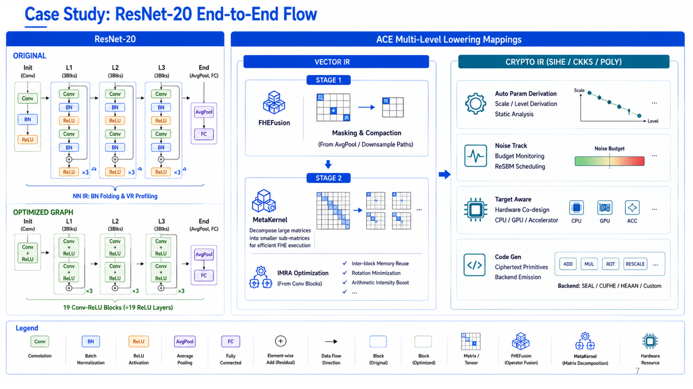

# Overall Design

## Overview

ANT-ACE is a unified Fully Homomorphic Encryption (FHE) instant computation framework (SDK).
This repository (ace-compiler) is its compiler component — FHE domain-specific compiler that compiles user programs — including PyTorch models, Python functions, ONNX models, and other supported frontends — into optimized FHE ciphertext computation programs. It supports multiple FHE libraries (running on CPU/GPU platforms) and encryption schemes (CKKS, [TFHE]).

The framework's core capability is **FHE computation** — for users, plaintext computation and FHE ciphertext computation are seamlessly integrated. Users write models using familiar PyTorch/ONNX/Python, and the framework automatically converts them to FHE ciphertext computation. FHE computation consists of two phases:

- **FHE Compilation**: Converts user code through frontends (model/IR conversion) and backend (IR lowering) to produce optimized FHE ciphertext computation programs.
- **FHE Inference**: The runtime loads compiled artifacts and executes encrypted inference — supporting single-input, batch, or dataset modes — with result validation and accuracy metrics.

The following diagram illustrates the end-to-end workflow from user code to encrypted inference:



## Framework Overview

```
+-------------------------------------------------------------------------------------------+
|                                  User Code (Python)                                       |
|  +----------------+  +----------------+  +----------------+  +-------------------------+  |
|  | @compile()     |  | @compute()     |  | @export()      |  | Direct API              |  |
|  | model / func   |  | model / func   |  | model / func   |  | compile(model / func)   |  |
|  +-------+--------+  +-------+--------+  +-------+--------+  +---------------+---------+  |
+----------+------------------+------------------+-------------------+----------------------+
           |                  |                  |                   |
           v                  v                  v                   v
+-------------------------------------------------------------------------------------------+
|                                Decorators Layer                                           |
|          - @compile: FHE compilation decorator (returns compiled program)                 |
|          - @compute: Compile + immediate execution (transparent FHE)                      |
|          - @export: Frontend IR export (returns AIR IR file)                              |
+-------------------------------------------------------------------------------------------+
                                        |
                                        v
+-------------------------------------------------------------------------------------------+
|                                   Pipeline Layer                                          |
|            - Orchestrates Frontend -> Backend -> Runtime                                  |
|            - Uses registry pattern for Frontend/Library selection                         |
+-------------------------------------------------------------------------------------------+
                                        |
            +---------------------------+---------------------------+
            v                           v                           v
    +-----------------------+ +---------------------------+ +-----------------------+
    |       Frontend        | |        Backend            | |       Library         |
    |   (IR Conversion)     | |      (IR Lowering)        | |  (Target Platforms)   |
    |                       | |                           | |                       |
    |  - onnx               | |  - IR lowering & optim    | |  - CPU                |
    |  - torch              | |  - FHE scheme fitting     | |  - GPU                |
    |  - ast                | |  - target code generation | |  - [Accelerator]      |
    +-----------------------+ +---------------------------+ +-----------------------+
                                        |
                                        v
+-------------------------------------------------------------------------------------------+
|                             Runtime Layer (python and cli)                                |
|            - Plaintext encrypt -> Ciphertext inference -> Result decrypt                  |
|              supports single-input / batch / parallel                                     |
|            - FHE context lifecycle management, built-in Profiling                         |
+-------------------------------------------------------------------------------------------+
```

## Module Overview

| Module | Directory | Purpose |
|--------|----------|---------|
| Decorators | `ace/fhe/decorators.py` | User API (@compile, @compute, @export) |
| Pipeline | `ace/fhe/pipeline/` | Orchestrate compilation and computation pipeline, with compilation cache (cache-key reuse) |
| Frontend | `ace/fhe/frontend/` | Convert Python functions/PyTorch models/ONNX to IR |
| Backend | `ace/fhe/backend/` | Multi-level IR lowering, code generation |
| Runtime | `ace/fhe/runtime/` | FHE execution: single/batch inference, built-in Profiling |
| Config | `ace/fhe/config/` | Compilation and Computation options dataclasses |
| Utility | `ace/fhe/util/` | Common utilities (logging, GPU detection, hashing, etc.) |

## Compilation

- [Compilation Pipeline](#compilation-pipeline): Frontend IR conversion -> Backend IR lowering -> Code generation
- [Input Types and Conversion Strategies](#input-types-and-conversion-strategies): Three input types, two conversion strategies
- [Backend Lowering Strategies](#backend-lowering-strategies): Target(CPU/GPU) lowering entry points

### Compilation Pipeline

> Compilation is controlled by cache-key for reuse; unchanged configurations automatically skip recompilation.

```
+--------------------------------------------------------------------------------+
|                              Frontend Layer                                    |
+--------------------------------------------------------------------------------+
|            onnx                   torch                   ast                  |
|           (file)           (FX symbolic trace)         (AST parse)             |
|             |                      |                       |                   |
|             v                      v                       v                   |
|          ONNX IR              Traced Graph                AST                  |
|             |                      |                       |                   |
|             v                      v                       v                   |
+--------------------------------------------------------------------------------+
                                     |
                                     v
+--------------------------------------------------------------------------------+
|                         Backend Input Formats                                  |
+--------------------------------------------------------------------------------+
|    AIR IR (.B file / in-memory)    |      ONNX IR (.onnx file)                 |
+--------------------------------------------------------------------------------+
                                     |
                                     v
+--------------------------------------------------------------------------------+
|                              Backend Layer                                     |
+--------------------------------------------------------------------------------+
|                                                                                |
|        TENSOR -> VECTOR -> SIHE -> CKKS -> [POLY]  ->  C/C++(...)              |
|                                                          |                     |
|                                                          v                     |
|                                          fhe-kernel (CPU / GPU / Accelerator)  |
|                                                                                |
+--------------------------------------------------------------------------------+
```

### Input Types and Conversion Strategies

The framework supports **three input types** with **two conversion strategies**:

| Input Type | Strategy A: Direct to AIR | Strategy B: Via ONNX (optional) |
|------------|--------------------------|--------------------------------|
| **ONNX File** | [ONNX -> AIR] | `onnx` |
| **PyTorch Model** | Traced Graph -> AIR | `torch-via-onnx` |
| **Python Function** | Traced Graph -> AIR / AST -> AIR | `torch-via-onnx` |

### Backend Lowering Strategies

| Target | Lowering Entry |
|--------|---------------|
| **CPU** | POLY -> C/C++ -> kernel |
| **GPU** | CKKS -> CUDA/C++ -> kernel |

## Runtime

- [Runtime Architecture](#runtime-architecture): Load compiled artifacts, execute ciphertext inference
- [Inference Phases](#inference-phases): Init -> Prepare -> Execute -> GetOutput -> Finalize
- [Profiling](#profiling): Per-phase timing and memory visibility

### Runtime Architecture

The runtime layer loads compiled FHE kernels and executes ciphertext inference:

```
CompiledProgram (callable)
  |
  v
FHERuntime              (Python)
  |
  +-- ConfigLoader      Parse config, bind to C++ runtime
  |
  +-- KernelExecutor    Manage single kernel lifecycle
  |     |
  |     +-- PROVIDER_MANAGER (C++)   Register/load kernels
  |           |
  |           +-- KERNEL_RUNNER (C++)   Init, Prepare, Execute, GetOutput, Finalize
  |
  +-- validate()          Result validation against plaintext
```

### Inference Phases

Each FHE inference goes through these phases, annotated with `FHE_PROFILE_SCOPE`:

```
fhe::init              Context initialization, key generation
fhe::prepare_input     Input encoding (plaintext -> ciphertext)
fhe::execute           Homomorphic computation
fhe::get_output        Output decoding (ciphertext -> plaintext)
fhe::finalize          Context teardown, memory reclamation
```

Inference results support single output, batch results (with timing), and dataset results (with accuracy metrics).

### Profiling

The runtime profiling system provides per-phase timing and memory visibility for FHE inference optimization. See [Runtime Profiling Design](runtime-profiling.md) for details.

## Client-Server Deployment [TBD]
1. kms

## Test Structure

Tests are organized into unit tests, integration tests, and regression tests. See [Testing](../testing.md) for details.


## File Structure

```
ace-compiler/
+-- fhe_dsl/                      # Dynamic scope
|   +-- python/                  # Python source for ace-fhe wheel package
|   |   +-- fhe/                  # pipeline, frontend, backend, runtime, profiling
|   |   +-- sample/               # Built-in ops, functions, and models (ResNet, etc.)
|   +-- csrc/                     # C++ extension source
|       +-- frontend/             # AIR generation
|       +-- runtime/              # FHE kernel lifecycle & execution management
|
+-- compiler/                     # FHE Backend (IR lowering & code generation)
|   +-- air-infra/                # AIR infrastructure
|   +-- fhe-bedriver/
|   |   +-- nn-addon/             # Neural network extensions (Tensor/Vector IR)
|   |   +-- fhe-cmplr/            # IR lowering and C/C++ code generation (SIHE/CKKS/POLY)
|   +-- airtool/                  # AIR tools
|   +-- driver/                   # Compiler Driver
|
+-- fhe_lib/                      # Compiler-compatible FHE libraries
+-- doc/                          # Documentation
+-- test/                         # Test suite
+-- example/                      # Example code
+-- script/                       # Build, development, and packaging scripts
```

## Related Documents

- [All Documents](../README.md) - Documentation index
- [Decorators Design](decorators.md) - Decorators and user-facing API
- [Frontend Design](frontend.md) - Frontend module details
- [Backend Design](backend.md) - Backend implementations
- [Pipeline Design](driver.md) - Pipeline and compiler orchestration
- [Runtime Profiling Design](runtime-profiling.md) - FHE profiling system design
- [Development Guide](../dev/develop.md) - Setup and workflow
